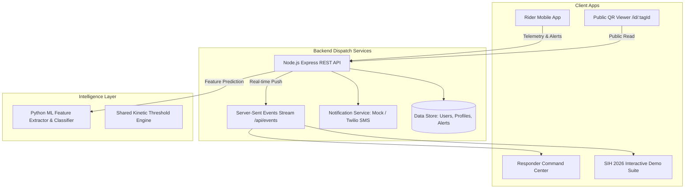

# Golden Hour — System Architecture

**Project Name:** Golden Hour  
**Tagline:** *When a victim cannot call for help, technology should speak for them.*  
**Problem Statement ID:** SIH26198  
**Category:** Software | **Theme:** MedTech / BioTech / HealthTech  

---

## 1. System Overview

Golden Hour is a mission-critical emergency response platform designed for road accidents involving vulnerable riders. When a rider crashes and loses consciousness, valuable minutes are lost before emergency contacts or first responders are notified.

Golden Hour establishes a dual-pathway response architecture:

1. **Primary Autonomous Pathway:**
   $$\text{Smartphone Sensors} \longrightarrow \text{Threshold/ML Crash Engine} \longrightarrow \text{"Are You OK?" 20s Safeguard} \longrightarrow \text{GPS + Alert Dispatch} \longrightarrow \text{Responder Command Center \& SMS Notifications}$$

2. **Secondary Bystander Pathway:**
   $$\text{Helmet / Vehicle QR Tag} \longrightarrow \text{Zero-Login Public Viewer (/id/:tagId)} \longrightarrow \text{Blood Group, Allergies \& 1-Click Family Calling}$$

---

## 2. Component Architecture

---

## 3. Kinetic Detection Math & Heuristics

The detection engine samples accelerometer $(a_x, a_y, a_z)$ and gyroscope $(\alpha, \beta, \gamma)$ telemetry at 10 Hz.

### Combined Acceleration Magnitude:
$$\|A\| = \sqrt{a_x^2 + a_y^2 + a_z^2} \quad (\text{m/s}^2)$$
$$\text{G-Force} = \frac{\|A\|}{9.80665}$$

### Rate of Acceleration Change (Jerk):
$$J = \frac{\Delta \|A\|}{\Delta t} \quad (\text{m/s}^3)$$

### Multi-Stage Decision Boundary:
1. **POSSIBLE_CRASH:** Peak acceleration $\ge 3.8\text{G}$ **AND** (Jerk $\ge 18.0\text{ m/s}^3$ OR Angular Tilt $\ge 55^\circ$).
2. **POTHOLE_OR_BUMP:** Peak acceleration between $2.0\text{G} - 3.8\text{G}$ with high vertical impulse but no sustained angular tilt.
3. **HARD_BRAKING:** Longitudinal deceleration spike $(1.4\text{G} - 2.5\text{G})$ with low jerk.
4. **NORMAL_RIDING:** Nominal riding dynamics ($\sim 1.0\text{G} \pm 0.3\text{G}$).

---

## 4. Privacy & Security Safeguards

- **Zero Exposure of Private Credentials:** The public QR endpoint `/api/profile/tag/:tagId` only returns essential triage data (blood group, allergies, pre-existing conditions, emergency contacts). Emails, passwords, and internal database IDs are stripped.
- **Server-Side Secrets:** Twilio API tokens and JWT secrets reside exclusively in backend environment variables.
